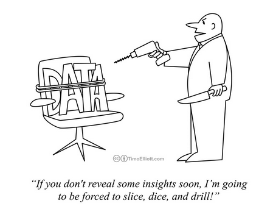
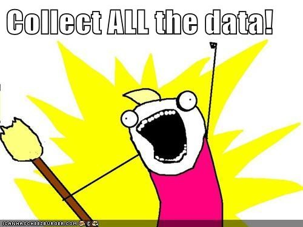

```{r setup, include=FALSE}
knitr::opts_chunk$set(echo = TRUE)
```

## Hello and Welcome!

Hello! And welcome to my Diary. My name is Isabelle Lobo and I am a data-scientist (well an aspiring one at least :P)! I am a 20 year old student at Amherst College majoring in statistics. The thing I love most about statistics and Data Science are the tools they equip me with to analyse data. And ofcourse the data science memes. 

```{r echo=FALSE, fig.cap="Data Science Memes!", out.width= '100%'}

```

As a student of data-science at Amherst the shift to remote learning has been challenging. But it has had so many positive outcomes. I have learned to work on statistics projects with people in different time zones and try to find solutions to my problems before I run to office hours. But most importantly, the huge changes between my life before and after COVID-19 has meant one thing. More! Data! To! Analyze!

## How do I spend my time?

A major change and challenge of remote learning has been the complete shift in how I schedule my time in the absence of the usual structures in place when on campus. 

I wanted to use the skills I have learned in my Data Science class to try and figure out whether I was scheduling my time better before or after COVID-19 and the shift to remote learning. Spending time in a completely different timezone made me wonder how effecient/ ineffecient the system of learning across timezones is. I wanted to see whether the shift in the timezone has created major difference in the way I scheduled my time between the mornings and the evenings. 

```{r, include=FALSE}
# you'll need to delete the eval=FALSE for this code chunk to execute
# but keep the include = FALSE so that it does not show up in the knit file (on the webpage)
library(tidyverse)
library(lubridate)
library(ical)
library(ggplot2)

my_calendar <- ical_parse_df(file = "file:///Users/Isabelle/git/Data-Science/isabellelobo11@gmail.com.ics") %>%
  mutate(start_datetime = with_tz(start, tzone = "Asia/Calcutta")
    , end_datetime = with_tz(end, tzone = "Asia/Calcutta")
    , length_min = end_datetime - start_datetime
    , length_sec = length_min*60
    , length_hrs = length_min/60
    , date = floor_date(start_datetime, unit = "day"))

#creating before and after COVID datasets 

before_cal <- my_calendar %>%
 mutate(date, date = as.Date(end_datetime, 
                    format = "%m/%d/%y")) %>%
filter( between(date, as.Date("2020-02-09"), 
                as.Date("2020-02-17"))) %>%
  mutate(when = "before")

after_cal <- my_calendar %>%
 mutate(date, date = as.Date(end_datetime, 
                      format = "%m/%d/%y")) %>%
filter( between(date, as.Date("2020-04-12"), 
                as.Date("2020-04-20"))) %>%
  mutate(when = "after" )

before_after <- bind_rows(before_cal, after_cal)

#Question1
#How was I dividing my time schedule before and after? 
#what you need: before or after, max time slots by activity, 
#avg duration of time slots by activity

#academics
study_before <- before_cal %>%
  filter(str_detect(tolower(summary), "ljst") | 
           str_detect(tolower(summary), "stat")
         | str_detect(tolower(summary), "homework") ) %>%
  mutate(activity_type = "Academics") %>%
  mutate(avg_duration = sum(length_min)/n())

study_after <- after_cal %>%
  filter(str_detect(tolower(summary), "ljst") | 
           str_detect(tolower(summary), "stat")
         | str_detect(tolower(summary), "homework") ) %>%
  mutate(activity_type = "Academics") %>%
  mutate(avg_duration = sum(length_min)/n())

study_before_after <- bind_rows(study_before, study_after) %>%
  select(summary, when, avg_duration, activity_type)

#athletics
athletics_before <- before_cal %>%
   filter(str_detect(tolower(summary), "work")) %>%
  filter(!str_detect(tolower(summary), "home")) %>%
  mutate(activity_type = "Athletics") %>%
  mutate(avg_duration = sum(length_min)/n())

athletics_after <- after_cal %>%
    filter(str_detect(tolower(summary), "work")) %>%
  filter(!str_detect(tolower(summary), "home")) %>%
  mutate(activity_type = "Athletics") %>%
  mutate(avg_duration = sum(length_min)/n())

athletics_before_after <- bind_rows(athletics_before, 
                                    athletics_after) %>%
  select(summary, when, avg_duration, activity_type)

#meals 

meals_before <- before_cal %>%
filter(str_detect(tolower(summary), "breakfast") 
         | str_detect(tolower(summary), "lunch")
         | str_detect(tolower(summary), "dinner") ) %>%
  mutate(activity_type = "Meals") %>%
  mutate(avg_duration = sum(length_min)/n())

meals_after <- after_cal %>%
filter(str_detect(tolower(summary), "breakfast") 
         | str_detect(tolower(summary), "lunch")
         | str_detect(tolower(summary), "dinner") ) %>%
  mutate(activity_type = "Meals") %>%
  mutate(avg_duration = sum(length_min)/n())

meals_before_after <- bind_rows(meals_before, meals_after) %>%
  select(summary, when, avg_duration, activity_type)

#extracurricular
extcur_before <- before_cal %>%
 filter(str_detect(tolower(summary), "piano")
         | str_detect(tolower(summary), "cab"))%>%
  mutate(activity_type = "Extracurricular") %>%
  mutate(avg_duration = sum(length_min)/n())

extcur_after <- after_cal %>%
 filter(str_detect(tolower(summary), "piano")
         | str_detect(tolower(summary), "cab"))%>%
  mutate(activity_type = "Extracurricular") %>%
  mutate(avg_duration = sum(length_min)/n())

extcur_before_after <- bind_rows(extcur_before, extcur_after) %>%
  select(summary, when, avg_duration, activity_type)

#health and wellness

hw_before <- before_cal %>%
 filter(str_detect(tolower(summary), "nap") 
         | str_detect(tolower(summary), "leisure")  
         | str_detect(tolower(summary), "choir") 
         | str_detect(tolower(summary), "church") ) %>%
 mutate(activity_type = "Health_Wellness") %>%
  mutate(avg_duration = sum(length_min)/n())

hw_after <- after_cal %>%
 filter(str_detect(tolower(summary), "nap") 
         | str_detect(tolower(summary), "leisure")  
         | str_detect(tolower(summary), "choir") 
         | str_detect(tolower(summary), "church") ) %>%
 mutate(activity_type = "Health_Wellness") %>%
  mutate(avg_duration = sum(length_min)/n())

hw_before_after <-  bind_rows(hw_before, hw_after) %>%
  select(summary, when, avg_duration, activity_type)

#timeslots final Q1 dataset 
ts_long <- bind_rows(study_before_after, athletics_before_after, 
                     meals_before_after, extcur_before_after, 
                     hw_before_after) %>%
  group_by(activity_type, when, avg_duration) %>%
 summarize(num_timeslots = n())

diary_q1 <- ts_long %>%
  rename( "Activity" = activity_type, "When" = when, 
          "Duration" = avg_duration, "Timeslots" = num_timeslots)


#Question2
#What time of the day was I busier morning or evening?
#what you need - AM and PM, each activity group, before and after

both_cal <- bind_rows(before_cal, after_cal)

ical_time <- both_cal %>%
  mutate(time = strftime(start_datetime, format = "%H:%M:%S"))

morn_cal <- ical_time %>%
filter( time < 12) %>%
  mutate(time_of_day = "Morning")

night_cal <-ical_time %>%
filter( time > 12) %>%
  mutate(time_of_day = "Evening")
  
#Academics
study_morn <- morn_cal %>%
  filter(str_detect(tolower(summary), "ljst") | 
           str_detect(tolower(summary), "stat")
         | str_detect(tolower(summary), "homework") ) %>%
  mutate(activity_type = "Academics") 

study_night <- night_cal %>%
  filter(str_detect(tolower(summary), "ljst") | 
           str_detect(tolower(summary), "stat")
         | str_detect(tolower(summary), "homework") ) %>%
  mutate(activity_type = "Academics") 

study_allday <- bind_rows(study_morn, study_night) %>%
  select(summary, when, time_of_day , activity_type)

#Athletics
ath_morn <- morn_cal %>%
  filter(str_detect(tolower(summary), "work")) %>%
  filter(!str_detect(tolower(summary), "home")) %>%
  mutate(activity_type = "Athletics") 

ath_night <- night_cal %>%
 filter(str_detect(tolower(summary), "work")) %>%
  filter(!str_detect(tolower(summary), "home")) %>%
  mutate(activity_type = "Athletics") 

ath_allday <- bind_rows(ath_morn, ath_night) %>%
  select(summary, when, time_of_day , activity_type)

#extracurricular
ext_morn <- morn_cal %>%
filter(str_detect(tolower(summary), "piano")
         | str_detect(tolower(summary), "cab"))%>%
  mutate(activity_type = "Extracurricular")  
  
ext_night <- night_cal %>%
 filter(str_detect(tolower(summary), "piano")
         | str_detect(tolower(summary), "cab"))%>%
  mutate(activity_type = "Extracurricular")

ext_allday <- bind_rows(ext_morn, ext_night) %>%
  select(summary, when, time_of_day , activity_type)


#Health_Wellness
hw_morn <- morn_cal %>%
  filter(str_detect(tolower(summary), "nap") 
         | str_detect(tolower(summary), "leisure")  
         | str_detect(tolower(summary), "choir") 
         | str_detect(tolower(summary), "church") ) %>%
 mutate(activity_type = "Health_Wellness") 
  
hw_night <- night_cal %>%
 filter(str_detect(tolower(summary), "nap") 
         | str_detect(tolower(summary), "leisure")  
         | str_detect(tolower(summary), "choir") 
         | str_detect(tolower(summary), "church") ) %>%
 mutate(activity_type = "Health_Wellness") 

hw_allday <- bind_rows(hw_morn, hw_night) %>%
  select(summary, when, time_of_day , activity_type)

#time of day final dataset Q2

diary_q2 <- bind_rows(hw_allday, ext_allday, 
                      ath_allday, study_allday) %>%
 rename("Name" = summary, "When" = when, 
        "TimeofDay" = time_of_day ,
          "Activity" = activity_type)
```


## Data Collection and Questions of Interest 
 In order to collect the data I used my google calendar schedule from the second week after the start of the semester and the second week after the shift to remote learning. I tried to keep it to the second week to avoid any instabilities during the one week period I usually take to "acclimatise" to a new schedule.My main topic of interest was how I was scheduling my time and not how I was sticking to the schedule so I used my intended, pre-planned schedule for both weeks. (I would also like to believe that I am a good student and I stick to my schedule :P)

```{r 123, echo=FALSE, fig.cap="Me telling myself to follow my schedule", out.width= '40%'}

```
 
 Then I took all the data I had collected and used it to answer two main questions: 
 
- 1) How did I divide my time before and after the shift to learning among my academics and other activities?
 
- 2) How has the change in timezone changed the way in which I schedule my time between the morning and the evening? 


## Data Presentation and Insights

> *Question 1*: How did I divide my time before and after the shift to remote learning among my academics and other activities?

```{r, fig.cap="Graph Comparing Number of Timeslots", echo= FALSE}
library(ggplot2)
ggplot(diary_q1, aes(x= When, y= Timeslots, color= Activity)) + 
labs(title = "Comparing Number of Timeslots by Activity Type, 
             Before and After COVID-19", 
    y = "Number of Timeslots")+
geom_bar(mapping = aes(color = Activity, fill=Activity), stat="identity")
```

My first graph compares the number of timeslots in a scheduled week per activity type before and after COVID-19 struck and we shifted to remote learning. I wanted to compare the number of timeslots to see whether I was using more scheduling to plan out my week before and after in each activity, which would indicate how many times I intended to place importance on each activity in a week. As you can see,before remote learning I had an overall minutely higher number of planned timeslots (43 timeslots) a week than after (41 timeslots). However, it is important to note that almost half of these went to planning my meals and the least went to activities related to my health and wellness(2 timeslots). However, after COVID-19, I have more timeslots for my health and wellness (11 timeslots to be exact), as well as extracurricular (4 timeslots as compared to 2 before) and athletics (10 timeslots as compared to 5 before). There are no timeslots for my meals after and Academic timeslots seem around the same for both. My conclusion after deliberating about the data is that in college, having to plan out my meals myself- such as when I could go with my friends, how much time it would take me to go to the dining hall etc.- was very time consuming. However back home, since my mother usually cooks, I did not have to spend time thinking about what, where, when or with who I was going to eat. This freed up a lot of time for me to focus on other areas of my life such as my health and wellness and extracurricular. Since I had access to all the extracurricular and health and wellness activities in my house while on lockdown and did not have travel across campus this also allowed me to spend more time on them. 


```{r, fig.cap="Graph Comparing Average Duration of Timeslots", echo= FALSE}
library(ggplot2)
ggplot(diary_q1, aes(x=Activity, y=Duration)) + 
  geom_point(size=5, aes(color= Activity)) + 
  geom_segment(aes(x=Activity, 
                   xend= Activity, 
                   y=0, 
                   yend=Duration)) + 
  labs(title="Lollipop Chart Comparing Average Duration of Timeslot by Activity, 
                                 Before and After COVID-19", 
       y = "Average Duration of Timeslot") + 
  facet_wrap(~When)+
  theme(legend.position = "none")+
  theme(axis.text.x = element_text(angle = 90, hjust = 1))

```
While number of timeslots in a week gave me an idea of what I was focusing on, I also wanted to see whether there was a difference in the amount of time I spent focusing on each activity. Hence I looked at the average duration per week spent on each activity as shown in the Lollipop Chart above. I used a lollipop chart because I think the idea of spending time on an activity is analogous to the amount of time you enjoy a lollipop for. I wanted to see how long- on average- I spent enjoying each of the activities in a week. As you can see, the highest average timeslot duration before was in Athletics (at around almost 125 minutes), and the lowest was in Health and Wellness (60 minutes) and Extracurricular(60 minutes). After COVID-19, there is a dramatic drop in the average duration of my athletics timeslot (to just 60 minutes), an increase in health and wellness (to 87.5 minutes) and a complete drop to 0 in average scheduled timeslot of meals. There was a slight increase by an average of 12.5 minutes of the average amount of time I scheduled for my academics as well. From the data and graph, I can conclude that being on the Varsity track team at Amherst involved me spending a larger time in one go only on Athleticss. Coming back home allowed me to shorten the intervals I spent on my Athletics, even though I increased the number of times (as indicated by the increase in timeslots) I trained per week. This allowed me to spend larger durations on my health and wellness, other extracurricular and academics. Being able to take my meals at home while I was doing other activities like academics or extracurricular also helped free up my schedule to enjoy for longer durations my the other activities. 

\newpage

> *Question 2*: How has the change in timezone changed the way in which I schedule my time between the morning and the evening?  


```{r, fig.cap="Graph Comparing Time of Day by Activity" , echo = FALSE}
ggplot(diary_q2) + geom_bar(aes(x = Activity, fill = TimeofDay), position = "fill") + 
  facet_wrap(~ When)+
  theme(axis.text.x = element_text(angle = 90, hjust = 1))+
  scale_fill_brewer(palette = "Set2") +
  labs(title="Bar Chart Comparing Proportion of Activity during by Time of Day, 
                             Before and After COVID-19" , y = "Proportion") 
```

To address my second question, I used a stacked bar graph which compares the proportion of each Activity done during the first half of the day (till 12 pm) and the second half of the day (from 12pm onward). I wanted to see whether shifting timezones from the US back to India would affect the time period at which I scheduled my daily activities. There were significatn differences however they were not what I had expected. As the graph shows, before COVID-19 and the shift to remote learning, the entire proportion of my Athletic and Health and Wellness activities were scheduled in the evening, my other Extracurricular were evenly spread with 50% in the morning and 50% in the evening, and my Academics were also almost evenly spread. The before graph seems to show more Activity on a whole in the evening. Whereas the graph after COVID-19 and the shift to remote learning, shows that am increase in the propotion of most activities to the morning half of the day. The entire proportion of Extracurricular activities are now scheduled in the morning, there is an increase by around 10% in the proportion of Health and Wellness activities in the morning, Athletic activity is now split evenly with 50% in the morning and 50% in the evening. Only Academics now has a higher proportion (almost 75%) of activities in the evening. After analyzing the graph, the conclusions I can draw are that surprisingly, I started to schedule more of my activies during the morning half of the day after the shift to remote learning although all my classes were now in the evening because of the timezone difference. I believe this change is because I am an early-bird so getting up early and having the whole morning to utilise efficiently before classes in the evening allows me to spend more time on my Health and Wellness, Athletics and Extracurricular in the morning than I would have been able to at Amherst. 

\newpage
## Final Conclusions 

The data has shown me that although there have been several changes in my schedule after the onset of COVID-19 and the shift to remote learning, not all of them have necessarily been bad and I have been able to see quite a few positive effects on my schedule. The first question allowed me to conclude that I have been able to fit more number of timeslots as well as amount of time for on health and wellness in my schedule as well as divide my time in athletics more effeciently into smaller timeslots. I also realised that a major advantage of being home was that home-cooked food meant I did not have to worry about fitting my meals into my schedule which opened up space for a lot of other activities in my schedule. The second question showed me that I have been able to optimise my day better with my mornings free to include a lot of my extracurricular activities in the morning half with my academics and classes now being scheduled in the evenings. I would like to maybe look into and compare my findings of my intended schedule with how I actually spend my day. I could track this in the future and further my project and research. Stay tuned for my further research which in honor of the fun theme of this project shall be named "Diary of a [Data Science Student]: The Long Haul".


## Reflection 

This project has been one of my favorite projects this semester and increased my fascination with Data Science. It was astounding to realise that I could glean so many insights from simple calendar schedule. With the skills I have acquired in this class, and through the project, I have realised that as a Data Scientist anything can be converted into data and the world is truly your oyster. Although it can be tiresome, data wrangling is undoubtedly my favorite part of the process. Being able to take information and transform it into the format you like feels like magic every single time. What is equally exciting is when you take this transformed data and transform it from simply words and numbers into what can only be called data art. After wrangling my data and creating visualizations, I gave my family a sneak peek into my diary and it was amazing to see that they could understand and interpret patterns in my schedule from just a few graphs. This has lead me to conclude that data visualization is truly the best asset to depict any type of information for any audience. 


```{r pressure, echo=FALSE, fig.cap="How I feel when I look at any information:", out.width = '50%'}

```

As an LJST and Statistics double major I have always been fascinated with the legal and ethical grounds for data provision, construction and use. In this project, I was given firsthand experience at being both a data provider and data analyst which allowed me to further reflect on these implications on both parties. This project showed me how easy it is for big tech companies to gather information on patterns in our daily lives. We often go about ticking the terms and conditions boxes on these companies' websites without a second glance, but does this mean we have given them consent to use our data freely and without any restrictions? There have been many legal cases- including against Facebook and the US Government- protesting the violation of individuals privacy by data collection. As a data provider, it makes me wonder whether checking the terms and conditions box signs all my rights to privacy away to big tech companies and the government. And are there other options or legal frameworks available to users who are essentially coerced by their necessity for technology into doing so? As a future data analyst, I think it is my legal and ethical responsibility to let users know what information I will be collecting and to limit my use of their data to only the specified reasons for data collection I have made them aware about. Ultimately, data collection can be a strong weapon if used incorrectly, however with the correct legal and ethical framework it serves to benefit the progress of society as a whole. 

# References

- Thank you to Albert Kim (Smith College) and Johanna Hardin (Pomona College) for the Google Calendar project idea.  They credit Roger Peng's and Hilary Parker's **Not So Standard Deviations** podcast titled "Compromised Shoe Situation" (http://nssdeviations.com/size/5/?search=shoe), in which they discuss a data science design challenge on getting to work on time, for the inspiration.

- Yupp, the title of this project is a play on the **Diary of a Wimpy Kid** book series.  We've been reading A LOT of these books in my house these days.  Many of the titles could be equally applicable here:
- Diary of a [Data Science Student]: Cabin Fever
- Diary of a [Data Science Student]: The Last Straw
- Diary of a [Data Science Student]: Dog Days
- Diary of a [Data Science Student]: The Ugly Truth
- Diary of a [Data Science Student]: Hard Luck
- Diary of a [Data Science Student]: The Long Haul
- Diary of a [Data Science Student]: Old School 
- The [Data Science Student] *Do-It-Yourself* Book
